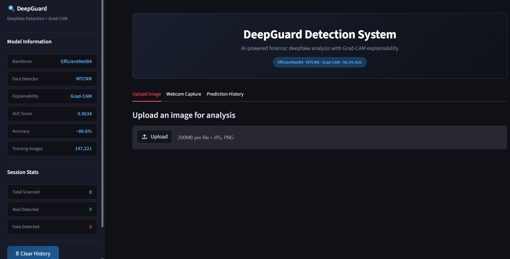
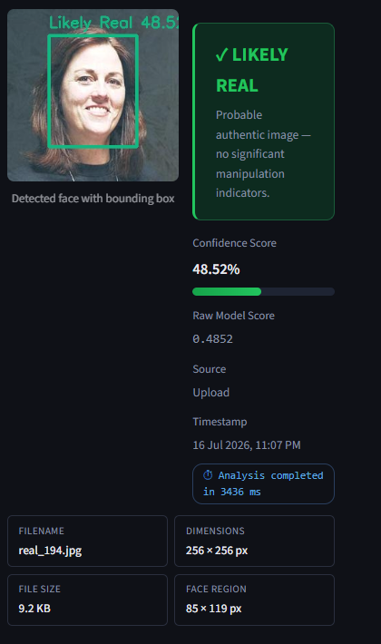
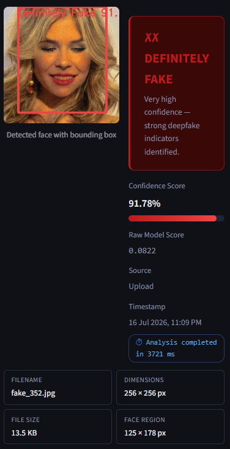
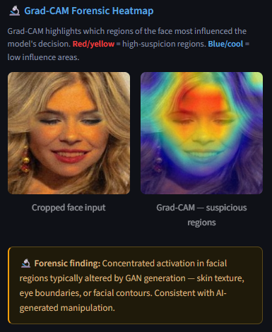
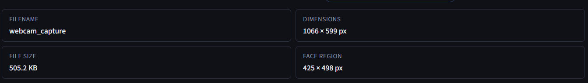
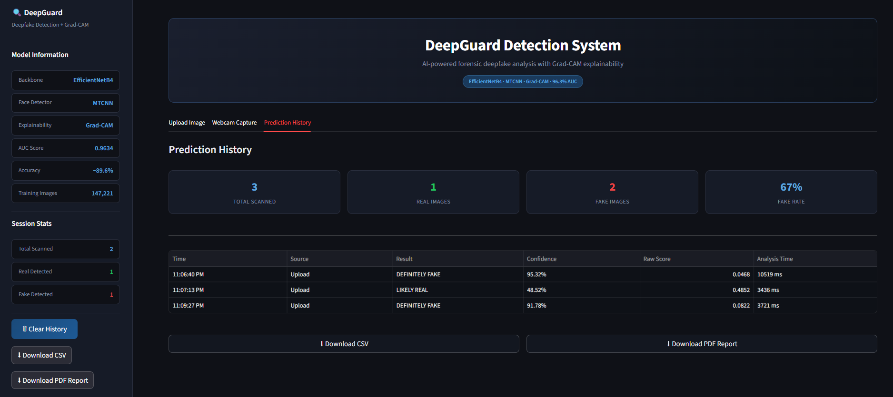
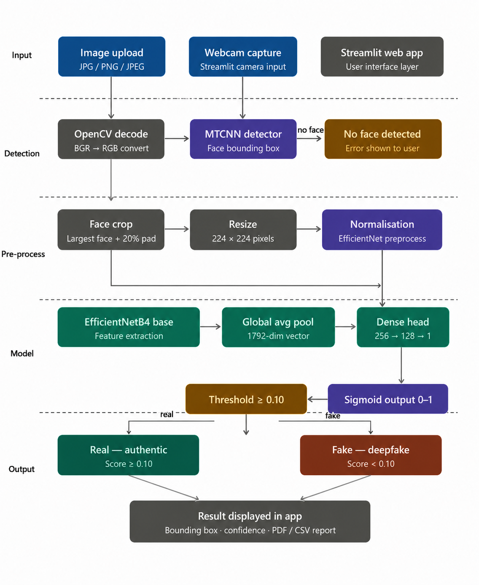

# 🛡️ DeepGuard

## AI-Powered Deepfake Image Detection with Forensic Visualization

DeepGuard is a Streamlit-based web application that detects deepfake facial images using **EfficientNetB4** and **MTCNN**, while providing explainable AI visualizations through **Grad-CAM**. The system allows users to upload images or capture them via webcam, classifies them as **Real** or **Fake**, and generates forensic reports.

---

## ✨ Features

- 🔍 Deepfake image detection using EfficientNetB4
- 👤 Automatic face detection using MTCNN
- 🔥 Grad-CAM forensic heatmap visualization
- 📷 Image upload and webcam capture
- 📊 Confidence score and raw model score
- 📄 PDF forensic report generation
- 📑 CSV prediction history export
- 📈 Prediction history dashboard
- 🌐 Interactive Streamlit web application

---

# 📸 Application Screenshots

## 🏠 Home Page



---

## ✅ Authentic Image Detection



---

## ❌ Deepfake Image Detection



---

## 🔥 Grad-CAM Forensic Heatmap



---

## 📷 Webcam Detection



---

## 📊 Prediction History



---

# 🏗️ System Architecture



---

# ⚙️ Technologies Used

| Category | Technology |
|-----------|------------|
| Programming Language | Python |
| Deep Learning | TensorFlow / Keras |
| Web Framework | Streamlit |
| Face Detection | MTCNN |
| Computer Vision | OpenCV |
| Numerical Computing | NumPy |
| Explainable AI | Grad-CAM |

---

# 🧠 Model Details

| Item | Value |
|------|-------|
| Backbone | EfficientNetB4 |
| Face Detection | MTCNN |
| Input Size | 224 × 224 |
| Classification | Real / Fake |
| Explainability | Grad-CAM |

---

# 📊 Performance

| Metric | Value |
|--------|------:|
| Validation AUC | **96.3%** |
| Validation Accuracy | **89.6%** |
| Framework | TensorFlow / Keras |

---

# 📂 Project Structure

```text
DeepGuard/
│
├── app.py
├── README.md
├── requirements.txt
├── .gitignore
│
├── models/
│   ├── class_indices.json
│   └── model_weights_v2_numpy.npy
│
├── screenshots/
│   ├── home_page.png
│   ├── definitely_real.png
│   ├── definitely_fake.png
│   ├── gradcam_heatmap.png
│   ├── prediction_history.png
│   ├── webcam_detection.png
│   └── architecture.png
```

---

# 🚀 Installation

Clone the repository

```bash
git clone https://github.com/Balajabamani/DeepGuard.git
```

Move into the project

```bash
cd DeepGuard
```

Install dependencies

```bash
pip install -r requirements.txt
```

Run the application

```bash
streamlit run app.py
```

---

# 📋 Usage

1. Launch the Streamlit application.
2. Upload an image or capture one using your webcam.
3. The application detects the face using MTCNN.
4. The AI model classifies the image as **Real** or **Fake**.
5. Grad-CAM highlights the image regions influencing the prediction.
6. View the confidence score and forensic explanation.
7. Download the PDF report or export prediction history as CSV.

---

# 📄 Output

The application provides:

- Prediction label
- Confidence score
- Raw model score
- Face bounding box
- Grad-CAM forensic heatmap
- Prediction history
- PDF forensic report
- CSV export

---

# 🎯 Future Improvements

- 🎥 Deepfake video detection
- ☁️ Cloud deployment
- 📱 Mobile application
- ⚡ Faster inference
- 🧩 Support for additional datasets

---

# 👨‍💻 Author

**Balajabamani D**

M.Sc. Artificial Intelligence & Cyber Security

---

⭐ If you found this project useful, consider giving it a **Star**.
